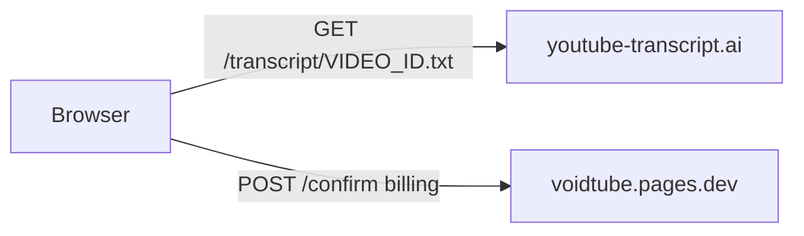

# Transcripts on Cloudflare Pages

VoidTube loads transcripts **in the browser** via [youtube-transcript.ai](https://youtube-transcript.ai/youtube-transcript-api). No relay, no Innertube, no Cloudflare IP issues.

## How it works

1. User clicks **Load transcript**
2. Browser fetches `https://youtube-transcript.ai/transcript/{VIDEO_ID}.txt`
3. Browser calls `POST /api/youtube/transcript/{VIDEO_ID}/confirm` to apply Freemium limits

## Configuration (optional)

| Variable | Default | Purpose |
|----------|---------|---------|
| `YOUTUBE_TRANSCRIPT_AI_BASE` | `https://youtube-transcript.ai` | API base URL (server/dev only) |
| `YOUTUBE_TRANSCRIPT_AI_LANG` | auto | Prefer `en`, `de`, etc. |
| `YOUTUBE_TRANSCRIPT_AI_TOKEN` | — | Commercial `X-YTS-Token` when licensed |

**Note:** Free tier is for low-volume testing. Email hello@youtube-transcript.ai before scaling.

## Local development

Same flow as production — browser → youtube-transcript.ai. No `.env` secrets required for transcripts.

## Legacy relay (optional, not used by default)

The repo still includes `server/transcript-proxy-server.js` for self-hosting, but VoidTube no longer uses it in production.
